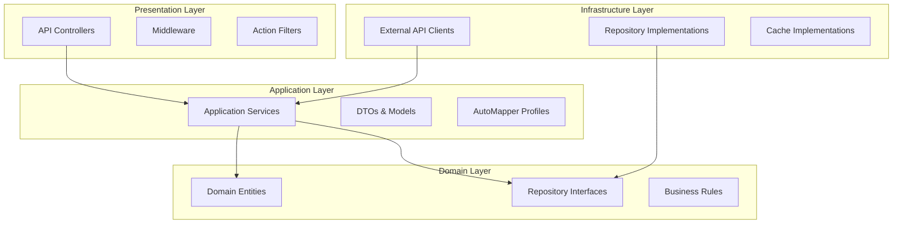
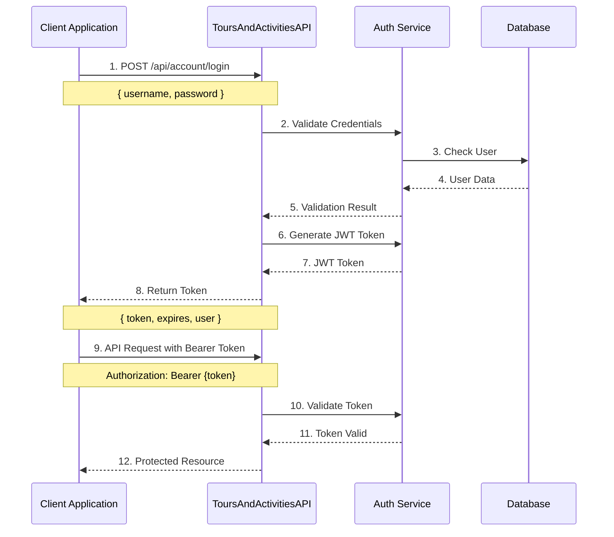
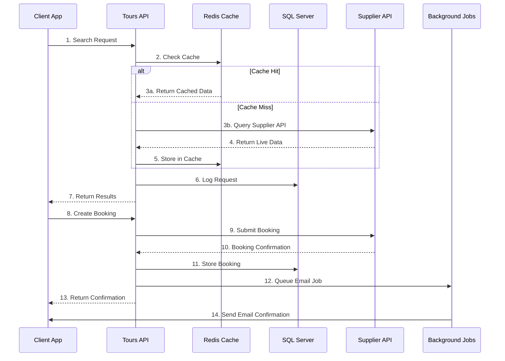
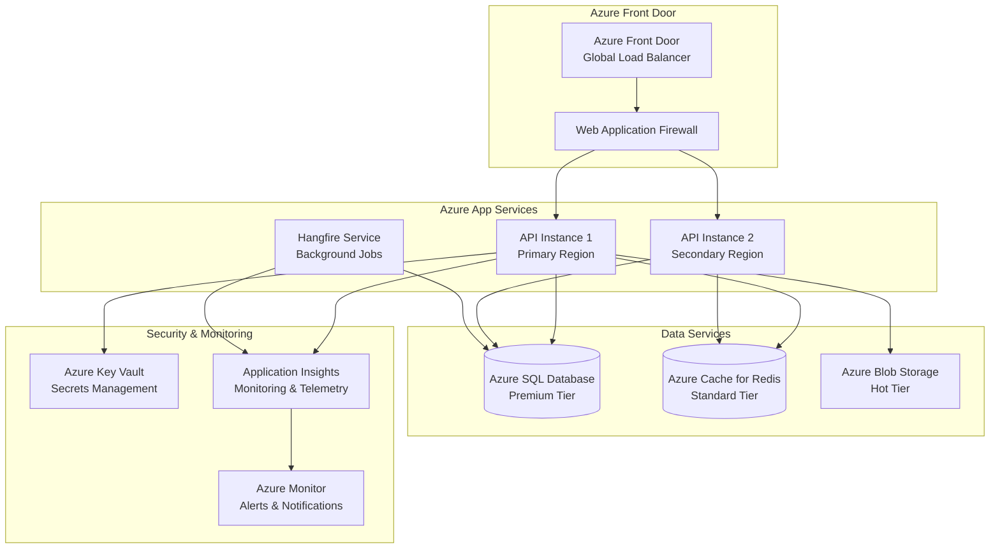
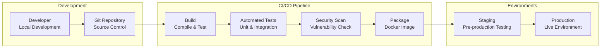
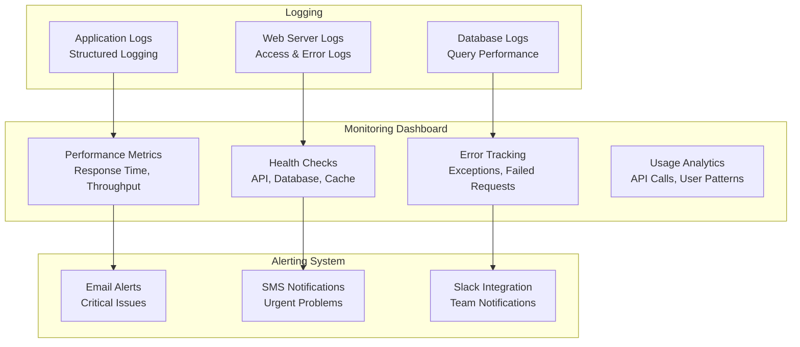

# Tours and Activities API

<div align="center">


**Enterprise-grade travel booking API serving 100K+ daily requests**

[Live Demo](https://www.hop-on-hop-off-bus.com) • [API Docs](#api-documentation--usage) • [Quick Start](#getting-started) • [Integrations](#supplier-api-integrations)

</div>

---

## Production Metrics

<div align="center">

| Metric | Value | Status |
|--------|-------|--------|
| **Daily API Requests** | 100,000+ | Active |
| **Response Time** | <200ms avg | Optimal |
| **Uptime SLA** | 99.9% | Maintained |
| **Supplier Integrations** | 20+ APIs | Active |
| **Supported Languages** | 4 (EN, DE, ES, FR) | Live |
| **Production Sites** | Multiple | Serving |

</div>

---

This comprehensive .NET 6 Web API powers www.hop-on-hop-off-bus.com and several related tour booking platforms. The system provides a unified interface for booking hop-on-hop-off bus tours, sightseeing activities, and experiences from over 20 suppliers worldwide. Built with enterprise-grade architecture, it handles high-volume traffic while maintaining exceptional performance and reliability.

## System Architecture Overview

<div align="center">


</div>

## About the Project

This enterprise API serves as the backbone for multiple travel booking platforms:

### Production Websites
- **[www.hop-on-hop-off-bus.com](https://www.hop-on-hop-off-bus.com)** - Primary hop-on-hop-off bus booking platform
- **Multiple white-label booking sites** - Powered by the same API infrastructure
- **Mobile applications** - iOS and Android apps using the API

### Core Purpose
The system specializes in hop-on-hop-off bus tours and city sightseeing experiences, integrating with over 20 major tour operators and booking platforms worldwide. It provides a unified API layer that aggregates inventory, pricing, and availability from multiple suppliers into a single, consistent interface. This approach simplifies the booking process for both developers and end users while ensuring real-time accuracy across all integrated platforms.

### Business Impact
- **Revenue Generation**: Powers major booking platforms generating significant daily revenue
- **Global Reach**: Serves customers in 100+ cities worldwide
- **Scalability**: Handles peak tourist season traffic without degradation
- **Reliability**: Mission-critical system with 99.9% uptime SLA

## Features

- **Multi-Supplier Integration**: Supports 20+ tour and activity suppliers with comprehensive API integrations:

  **🚌 Hop-on-Hop-off Bus Operators:**
  - **BigBus** - Global hop-on-hop-off bus operator with real-time tracking
  - **City Sightseeing** - Worldwide sightseeing tours in 100+ cities
  - **Golden Tours** - London sightseeing and hop-on-hop-off tours
  - **Gray Line** - Sightseeing tours worldwide

  **🎫 Ticketing & Attractions:**
  - **Tiqets** - Museum and attraction tickets with certificate-based authentication
  - **Ventrata** - Attraction management system with real-time inventory
  - **GoCity** - City attraction passes and multi-attraction tickets

  **🏢 Tour Management Platforms:**
  - **TourCMS** - Comprehensive tour management and booking system
  - **Bokun** - Advanced tour booking platform with Channel Manager API
  - **Rezdy** - Tour and activity booking software with Agent API
  - **FareHarbor** - Activity booking software with External API

  **🌐 Distribution Networks:**
  - **HotelBeds** - Travel distribution platform (APItude API Suite)
  - **Redeam** - Tour and activity distribution network
  - **Isango** - Global tours and activities marketplace

  **🔧 Integration Features:**
  - Real-time availability and pricing
  - Automated booking confirmations
  - Multi-language support
  - Certificate-based secure connections
  - Webhook notifications
  - Rate limiting and caching

- **Hop-on-Hop-off Bus Specialization**:
  - Real-time bus availability and scheduling
  - Route and stop management
  - Multi-day pass bookings
  - Mobile ticket generation
  - GPS tracking integration

- **Comprehensive Booking Management**:
  - Real-time availability checking
  - Booking creation and management
  - Cancellation and refund handling
  - Digital voucher generation
  - Payment processing integration
  - Group booking support

- **Advanced Features**:
  - JWT Authentication with multi-site support
  - Distributed caching with Redis
  - Background job processing with Hangfire
  - Multi-language support (EN, DE, ES, FR)
  - Email notifications with branded templates
  - PDF voucher generation with QR codes
  - Dynamic pricing and discount rules engine
  - Mobile-responsive ticket delivery

## Project Architecture & Structure

### Solution Structure

```mermaid
graph TD
    subgraph "Core Domain"
        API[Tours API<br/>Main Web API]
        ENTITIES[Isango.Entities<br/>Domain Models]
        SERVICE[Isango.Service<br/>Business Logic]
        PERSIST[Isango.Persistence<br/>Data Access]
    end

    subgraph "Infrastructure"
        ADAPTERS[ServiceAdapters<br/>External APIs]
        CACHE[CacheManager<br/>Caching Layer]
        LOGGER[Logger<br/>Logging System]
        UTIL[Util<br/>Common Tools]
    end

    subgraph "Background Services"
        ASYNC[AsyncBooking.HangFire<br/>Async Processing]
        LOADER[CacheLoader.HangFire<br/>Cache Management]
        DUMP[DataDumping.HangFire<br/>Data Sync]
    end

    subgraph "🧪 Testing"
        TESTS[🧪 Test Projects<br/>Unit & Integration]
    end

    API --> SERVICE
    API --> ENTITIES
    SERVICE --> PERSIST
    SERVICE --> ADAPTERS
    SERVICE --> CACHE

    ADAPTERS --> LOGGER
    CACHE --> LOGGER
    SERVICE --> UTIL

    ASYNC --> SERVICE
    LOADER --> CACHE
    DUMP --> PERSIST

    TESTS --> API
    TESTS --> SERVICE
    TESTS --> ADAPTERS
```

<div align="center">



</div>

### Technology Stack

<div align="center">

| Layer | Technologies | Purpose |
|-------|-------------|---------|
| **🎯 API Layer** | ASP.NET Core 6, Swagger/OpenAPI | RESTful API endpoints |
| **⚙️ Business Logic** | C# Services, AutoMapper | Domain logic & mapping |
| **🗄️ Data Access** | Entity Framework Core, SQL Server | ORM & database operations |
| **⚡ Caching** | Redis, IMemoryCache | Performance optimization |
| **🔄 Background Jobs** | Hangfire | Async processing |
| **🔐 Security** | JWT Bearer, Certificate Auth | Authentication & authorization |
| **📝 Logging** | log4net, Application Insights | Monitoring & diagnostics |
| **📧 Communication** | SMTP, Email Templates | Notifications |
| **🐳 Deployment** | Docker, Azure | Containerization & cloud |

</div>

### Clean Architecture Layers



## Getting Started

### Prerequisites

- .NET 6.0 SDK or later
- SQL Server (2019 or later)
- Redis (optional, for caching)
- Visual Studio 2022 or VS Code

### Installation

1. **Clone the repository**
   ```bash
   git clone https://github.com/yourusername/ToursAndActivities.git
   cd ToursAndActivities
   ```

2. **Configure the application**
   ```bash
   cd Tours-Activities-API
   cp appsettings.example.json appsettings.json
   ```
   
   Edit `appsettings.json` with your configuration:
   - Database connection strings
   - JWT settings
   - API keys for various suppliers
   - Email configuration

3. **Set up the database**
   ```bash
   # Update connection string in appsettings.json first
   dotnet ef database update
   ```

4. **Build and run**
   ```bash
   dotnet build
   cd Tours-Activities-API
   dotnet run
   ```

5. **Access the API**
   - Swagger UI: `https://localhost:5001/swagger`
   - API Base URL: `https://localhost:5001/api`

## Configuration

### Required Configuration

Create your `appsettings.json` based on `appsettings.example.json`:

#### Database Configuration
```json
{
  "ConnectionStrings": {
    "DefaultConnection": "Server=YOUR_SERVER;Database=ToursActivitiesDB;Trusted_Connection=true;",
    "IsangoLiveDB": "Server=YOUR_SERVER;Database=IsangoDB;Trusted_Connection=true;"
  }
}
```

#### JWT Configuration
```json
{
  "Jwt": {
    "Key": "your-secret-key-minimum-32-characters",
    "Issuer": "https://yourdomain.com",
    "Audience": "https://yourdomain.com"
  }
}
```

#### Supplier API Keys
Configure API keys for the suppliers you want to integrate with:
```json
{
  "AppSettings": {
    "ApiKey": "your-main-api-key",
    "ApiSecret": "your-main-api-secret",
    "TiqetsApiKey": "your-tiqets-key",
    "BokunApiKey": "your-bokun-key"
  }
}
```

### Optional Configuration

- **Application Insights**: For monitoring and telemetry
- **Redis**: For distributed caching
- **Email Settings**: For notification emails
- **Certificate Paths**: For secure supplier integrations

## API Documentation & Usage

### Authentication Flow

<div align="center">



</div>

**Authentication Example:**
```http
POST /api/account/login
Content-Type: application/json

{
  "username": "your-username",
  "password": "your-password"
}

Response:
{
  "token": "eyJhbGciOiJIUzI1NiIsInR5cCI6IkpXVCJ9...",
  "expires": "2024-01-15T10:30:00Z",
  "user": {
    "id": 123,
    "username": "your-username",
    "roles": ["User", "BookingAgent"]
  }
}
```

### API Endpoint Categories

<div align="center">

```mermaid
graph TB
    subgraph "Core API Endpoints"
        AUTH[Authentication<br/>/api/account/*]
        SEARCH[Activity Search<br/>/api/activity/search]
        DETAILS[Activity Details<br/>/api/activity/{id}]
        AVAIL[Availability<br/>/api/activity/{id}/availability]
        BOOKING[Booking Management<br/>/api/booking/*]
        MASTER[Master Data<br/>/api/master/*]
    end

    subgraph "Management APIs"
        ADMIN[Admin Functions<br/>/api/admin/*]
        REPORTS[Reporting<br/>/api/reports/*]
        CACHE[Cache Management<br/>/api/cache/*]
        HEALTH[Health Checks<br/>/api/health]
    end

    subgraph "🔗 Integration APIs"
        WEBHOOK[🔔 Webhooks<br/>/api/webhooks/*]
        SUPPLIER[🏢 Supplier Sync<br/>/api/suppliers/*]
        PAYMENT[💳 Payment Processing<br/>/api/payments/*]
    end
```

</div>

### Key API Workflows

#### Activity Search Workflow

```http
GET /api/activity/search?destination=London&startDate=2024-01-15&adults=2
Authorization: Bearer {your-jwt-token}

Response:
{
  "results": [
    {
      "id": "ACT001",
      "name": "London Hop-on Hop-off Bus Tour",
      "description": "Explore London's iconic landmarks...",
      "price": {
        "amount": 35.00,
        "currency": "GBP"
      },
      "duration": "24 hours",
      "category": "Sightseeing",
      "supplier": "BigBus",
      "availability": "Available",
      "images": ["https://..."],
      "rating": 4.5,
      "reviewCount": 1250
    }
  ],
  "totalCount": 45,
  "page": 1,
  "pageSize": 10
}
```

#### Availability Check

```http
GET /api/activity/ACT001/availability?date=2024-01-15&adults=2&children=1
Authorization: Bearer {your-jwt-token}

Response:
{
  "activityId": "ACT001",
  "date": "2024-01-15",
  "available": true,
  "timeSlots": [
    {
      "time": "09:00",
      "available": true,
      "price": 35.00,
      "spotsRemaining": 15
    },
    {
      "time": "11:00",
      "available": true,
      "price": 35.00,
      "spotsRemaining": 8
    }
  ],
  "restrictions": {
    "minAge": 0,
    "maxGroupSize": 20,
    "wheelchairAccessible": true
  }
}
```

#### Booking Creation

```http
POST /api/booking/create
Authorization: Bearer {your-jwt-token}
Content-Type: application/json

{
  "activityId": "ACT001",
  "date": "2024-01-15",
  "timeSlot": "09:00",
  "participants": [
    {
      "type": "Adult",
      "firstName": "John",
      "lastName": "Doe",
      "age": 35
    },
    {
      "type": "Adult",
      "firstName": "Jane",
      "lastName": "Doe",
      "age": 32
    }
  ],
  "customer": {
    "email": "john.doe@example.com",
    "phone": "+44 20 1234 5678",
    "firstName": "John",
    "lastName": "Doe"
  },
  "payment": {
    "method": "CreditCard",
    "amount": 70.00,
    "currency": "GBP"
  }
}

Response:
{
  "bookingId": "BK123456",
  "confirmationNumber": "CONF789012",
  "status": "Confirmed",
  "totalAmount": 70.00,
  "currency": "GBP",
  "voucher": {
    "url": "https://api.example.com/vouchers/BK123456.pdf",
    "qrCode": "https://api.example.com/qr/BK123456"
  },
  "cancellationPolicy": {
    "cancellable": true,
    "deadline": "2024-01-14T23:59:59Z",
    "refundPercentage": 100
  }
}
```

### API Response Standards

All API responses follow a consistent format:

```json
{
  "success": true,
  "data": { /* Response data */ },
  "message": "Operation completed successfully",
  "timestamp": "2024-01-15T10:30:00Z",
  "requestId": "req_123456789"
}
```

**Error Response Format:**
```json
{
  "success": false,
  "error": {
    "code": "VALIDATION_ERROR",
    "message": "Invalid request parameters",
    "details": [
      {
        "field": "date",
        "message": "Date must be in the future"
      }
    ]
  },
  "timestamp": "2024-01-15T10:30:00Z",
  "requestId": "req_123456789"
}
```

### Interactive Documentation

- **🌐 Swagger UI**: Available at `/swagger` when running the application
- **📋 Postman Collection**: Complete API collection with examples
- **🔧 API Testing**: Built-in testing tools and mock responses
- **📚 Code Examples**: Available in multiple programming languages

**Access Documentation:**
```bash
# Start the application
dotnet run

# Open browser to:
https://localhost:5001/swagger
```

## Supplier API Integrations

### BigBus API Integration
- **Endpoint**: `https://api.bigbus.com/`
- **Authentication**: Username/Password
- **Features**: Real-time bus tracking, route information, multi-day passes
- **Data Format**: JSON/XML
- **Rate Limiting**: Standard commercial limits

### Tiqets Distributor API
- **Endpoint**: `https://api.tiqets.com/`
- **Authentication**: Certificate-based (X.509)
- **Features**: Museum tickets, attraction passes, real-time availability
- **Certificates**: Production and City Sightseeing specific certificates
- **Documentation**: [Tiqets Distributor API](https://portals.tiqets.com/distributorapi/docs)

### Bokun Channel Manager API
- **Endpoint**: `https://api.bokun.io/`
- **Authentication**: API Key + Secret
- **Features**: Inventory management, booking creation, real-time sync
- **Cost**: $199/month + 0.5-1.5% booking charge
- **Documentation**: [Bokun API Docs](https://bokun.dev/)

### Rezdy Agent API
- **Endpoint**: `https://api.rezdy.com/v1/`
- **Authentication**: API Key (Header or Query Parameter)
- **Features**: Product search, availability, booking management
- **Rate Limiting**: 100 calls/minute
- **Documentation**: [Rezdy API Specification](https://developers.rezdy.com/rezdyapi/index-agent.html)

### FareHarbor External API
- **Endpoint**: `https://fareharbor.com/api/external/v1/`
- **Authentication**: API Key + User/App credentials
- **Features**: Activity booking, customer management, webhooks
- **Documentation**: [FareHarbor Integration Center](https://developer.fareharbor.com/api/external/v1/)

### TourCMS API
- **Endpoint**: `https://api.tourcms.com/`
- **Authentication**: Channel ID + API Key with HMAC signature
- **Features**: Tour operator content, booking management, marketplace access
- **Documentation**: [TourCMS API Methods](https://www.tourcms.com/support/api/methods.php)

### HotelBeds APItude Suite
- **Endpoint**: `https://api.test.hotelbeds.com/` (Test) / `https://api.hotelbeds.com/` (Live)
- **Authentication**: API Key + Secret with signature
- **APIs**:
  - **Activities Booking API**: Activity reservations and management
  - **Activities Content API**: Portfolio and destination content
  - **Activities Cache API**: Price and availability data
- **Documentation**: [HotelBeds Developer Portal](https://developer.hotelbeds.com/)

### City Sightseeing Integration
- **Integration**: Via Tiqets API with dedicated certificates
- **Coverage**: 100+ cities worldwide
- **Features**: Hop-on-hop-off bus tours, audio guides, group bookings
- **Authentication**: Certificate-based through Tiqets platform

### API Request Flow

<div align="center">



</div>

### Integration Architecture

<div align="center">


</div>

### API Response Standardization
All supplier APIs are normalized into a consistent response format:
- **Products**: Standardized activity/tour information
- **Availability**: Unified availability and pricing data
- **Bookings**: Consistent booking confirmation format
- **Errors**: Standardized error handling and messaging

## Testing

Run the test suite:

```bash
dotnet test
```

The solution includes comprehensive unit tests for:
- Service layer logic
- Data persistence
- External API adapters
- Booking workflows

## Development

### Adding New Suppliers

1. Create a new adapter in `ServiceAdapters` project
2. Implement the required interfaces
3. Add configuration settings
4. Register the adapter in the DI container
5. Add unit tests

### Background Jobs

The system uses Hangfire for background processing:
- Cache warming
- Data synchronization
- Async booking processing
- Email notifications

Access the Hangfire dashboard at `/hangfire` (in development).

## Deployment & Infrastructure

### Docker Deployment

```mermaid
graph TB
    subgraph "Docker Environment"
        subgraph "Application Container"
            API[ToursAndActivitiesAPI<br/>Port 80]
            HANGFIRE[Hangfire Dashboard<br/>Port 8080]
        end

        subgraph "Database Container"
            SQL[SQL Server<br/>Port 1433]
        end

        subgraph "Cache Container"
            REDIS[Redis<br/>Port 6379]
        end

        subgraph "Monitoring"
            INSIGHTS[📊 App Insights]
        end
    end

    API --> SQL
    API --> REDIS
    API --> INSIGHTS
    HANGFIRE --> SQL
```

<div align="center">



</div>

**Quick Docker Setup:**
```bash
# Clone and build
git clone https://github.com/sandeepkumar0801/ToursAndActivities.git
cd ToursAndActivities

# Build the image
docker build -t tours-api .

# Run with docker-compose
docker-compose up -d

# Access the application
# API: http://localhost:8080
# Swagger: http://localhost:8080/swagger
# Hangfire: http://localhost:8080/hangfire
```

### Azure Cloud Architecture

<div align="center">



</div>

**Azure Deployment Features:**
- ✅ **Auto-scaling**: Handles traffic spikes automatically
- ✅ **High Availability**: 99.9% SLA with multi-region deployment
- ✅ **Security**: Key Vault integration for secrets management
- ✅ **Monitoring**: Application Insights with custom dashboards
- ✅ **Performance**: Azure CDN for static content delivery
- ✅ **Backup**: Automated database backups with point-in-time recovery

### Production Deployment Pipeline

<div align="center">



</div>

**Deployment Process:**
1. **🔨 Build**: Automated compilation and dependency resolution
2. **🧪 Testing**: Comprehensive test suite execution
3. **🔒 Security**: Vulnerability scanning and compliance checks
4. **📦 Packaging**: Docker image creation and registry push
5. **🎭 Staging**: Deployment to staging environment for final testing
6. **🚀 Production**: Blue-green deployment to production with zero downtime

### Infrastructure Monitoring

<div align="center">



</div>

## Contributing

1. Fork the repository
2. Create a feature branch (`git checkout -b feature/amazing-feature`)
3. Commit your changes (`git commit -m 'Add amazing feature'`)
4. Push to the branch (`git push origin feature/amazing-feature`)
5. Open a Pull Request

## License

This project is licensed under the MIT License - see the [LICENSE](LICENSE) file for details.

## Support

For support and questions:
- Create an issue in this repository
- Check the [documentation](docs/)
- Review the API documentation at `/swagger`

## System Architecture

### Technology Stack

- **Backend**: .NET 6, ASP.NET Core Web API
- **Database**: SQL Server with Entity Framework Core
- **Caching**: Redis, In-Memory Cache
- **Background Jobs**: Hangfire
- **Authentication**: JWT Bearer tokens
- **Documentation**: Swagger/OpenAPI
- **Logging**: log4net
- **PDF Generation**: PDFreactor
- **Email**: SMTP with HTML templates
- **Dependency Injection**: Autofac

### Integration Patterns

The system uses various integration patterns:

- **Adapter Pattern**: For supplier integrations
- **Factory Pattern**: For creating supplier-specific services
- **Repository Pattern**: For data access
- **Command Pattern**: For booking operations
- **Observer Pattern**: For event handling

### Data Flow

1. **Request**: Client sends API request
2. **Authentication**: JWT token validation
3. **Routing**: Request routed to appropriate controller
4. **Business Logic**: Service layer processes request
5. **Data Access**: Repository layer interacts with database
6. **External APIs**: Adapter layer calls supplier APIs
7. **Response**: Formatted response returned to client

## Security Considerations

### Authentication & Authorization
- JWT tokens with configurable expiration
- Role-based access control
- API key authentication for external integrations

### Data Protection
- Sensitive data encryption at rest
- HTTPS enforcement
- Input validation and sanitization
- SQL injection prevention through parameterized queries

### Supplier Integration Security
- Certificate-based authentication for secure suppliers
- API key rotation support
- Request signing for critical operations
- Rate limiting and throttling

## Monitoring & Observability

### Application Insights
- Performance monitoring
- Error tracking
- Custom telemetry
- Dependency tracking

### Logging
- Structured logging with log4net
- Different log levels for environments
- Request/response logging
- Error logging with stack traces

### Health Checks
- Database connectivity
- External API availability
- Cache status
- Background job status

## Background Processing

### Hangfire Jobs

#### Recurring Jobs
- **Cache Warming**: Preloads frequently accessed data
- **Data Synchronization**: Syncs with supplier systems
- **Cleanup Tasks**: Removes expired data

#### Fire-and-Forget Jobs
- **Email Notifications**: Sends booking confirmations
- **Webhook Processing**: Handles supplier callbacks
- **Report Generation**: Creates analytics reports

#### Delayed Jobs
- **Booking Reminders**: Sends pre-departure emails
- **Payment Retries**: Retries failed payments
- **Cancellation Processing**: Handles delayed cancellations

## Internationalization

### Supported Languages
- English (EN)
- German (DE)
- Spanish (ES)
- French (FR)

### Localization Features
- Multi-language email templates
- Localized voucher generation
- Currency formatting
- Date/time formatting
- Error messages translation

## Testing Strategy

### Unit Tests
- Service layer business logic
- Repository layer data access
- Mapper functionality
- Validation logic

### Integration Tests
- API endpoint testing
- Database integration
- External API mocking
- End-to-end booking flows

### Performance Tests
- Load testing for high traffic
- Stress testing for peak loads
- Memory usage optimization
- Database query performance

## Performance Optimization

### Caching Strategy
- **L1 Cache**: In-memory for frequently accessed data
- **L2 Cache**: Redis for distributed caching
- **HTTP Caching**: Response caching for static data
- **Database Caching**: Query result caching

### Database Optimization
- Indexed queries for fast lookups
- Connection pooling
- Async operations
- Bulk operations for data imports

### API Optimization
- Response compression
- Pagination for large datasets
- Lazy loading for related data
- Minimal API responses

## Acknowledgments

- Built with .NET 6 and ASP.NET Core
- Uses Entity Framework Core for data access
- Integrates with multiple tour and activity suppliers
- Inspired by the need for unified booking experiences
- Special thanks to the open-source community for the amazing tools and libraries
